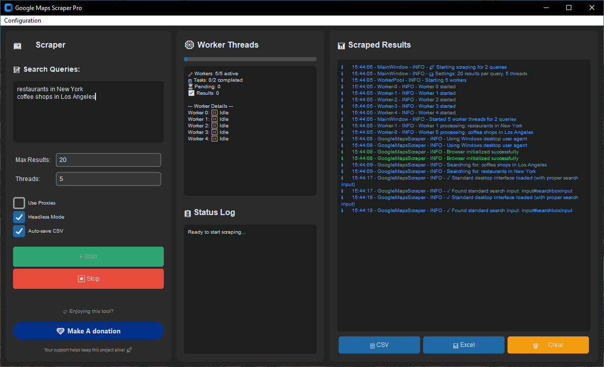

# Google Maps Scraper Pro

**Google Maps Scraper Pro** is a fast, user-friendly tool for extracting business data from Google Maps. It features a modern interface, advanced anti-detection, and real-time monitoring. Perfect for researchers, marketers, and data enthusiasts.

---

## � Features

- **Modern GUI:** Simple three-column layout for input, monitoring, and logs.
- **Multi-Threaded:** Fast scraping with up to 10 parallel threads.
- **Anti-Detection:** Stealth, user agent rotation, and interface handling.
- **Auto-Save:** Results saved instantly to CSV files.
- **Desktop Notifications:** Alerts when scraping completes or errors occur.
- **Comprehensive Data:** Extracts name, rating, reviews, address, phone, website, hours, and more.
- **Proxy Support:** Rotate proxies for safer, large-scale scraping.

---


## 📸 Screenshots

Below are some screenshots of Google Maps Scraper Pro in action:

<p align="center">
	
	<br>
	
	<br>
	
	<br>
	
</p>

---

## ⚡ Quick Start

### Prerequisites

- Python 3.10+ (Windows, macOS, Linux)
- 4GB+ RAM recommended

### Installation

```powershell
# Clone the repo and enter the folder

cd mad_google_map_extractor

# Create and activate a virtual environment
python -m venv env
.\env\Scripts\Activate.ps1

# Install dependencies
pip install -r requirements.txt

# Install Playwright browsers
playwright install chromium
```

### Run the Scraper

```powershell
python main.py
```

---

## 📝 Usage

1. **Enter search queries** (e.g., `restaurants in New York`) in the left panel.
2. **Set options:** Max results, threads, proxies, headless mode.
3. **Start scraping:** Monitor progress and logs in real time.
4. **Get results:** CSV files are auto-saved in the `output/` folder.

---

## 📦 Output

- **Per-query CSVs:** Each search saves a separate CSV.
- **Combined CSV:** All unique results merged at the end.
- **Log files:** Detailed logs in the `logs/` folder.

---

## 🛠️ Troubleshooting

- **Module errors?** Activate your virtual environment and reinstall requirements.
- **Browser errors?** Run `playwright install chromium` again.
- **No results?** Try broader queries or enable proxies.

---

## 🤝 Contribute

Want to support development?

[](https://www.paypal.me/mad10079/10/)

---

## ⚖️ Legal Notice

- For educational and research use only.
- Respect Google’s Terms of Service and robots.txt.
- Do not use for commercial scraping or spamming.

---

## 📄 License

MIT License – see LICENSE file.

---

**Google Maps Scraper Pro – Fast, reliable, and ethical Google Maps data extraction.**

---

**Happy Scraping!**

*Remember: Scrape responsibly and ethically. Respect website terms of service and rate limits.*

